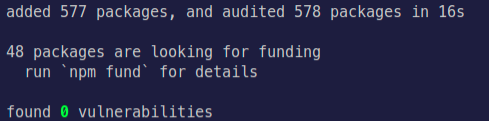
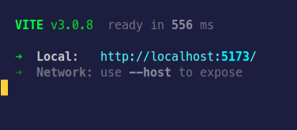

# Studio Ghibli Films


<p style="text-align:center;">Light weight react application for listing ghibli studio films.</p>

## Index

---

- [Studio Ghibli Films](#studio-ghibli-films)
  - [Index](#index)
    - [1. Description](#1-description)
    - [2. Get Started](#2-get-started)
      - [2.1 Installing Dependencies](#21-installing-dependencies)
      - [2.4 Starting Development Server](#24-starting-development-server)
    - [5. Testing](#5-testing)
    - [6. In Depth](#6-in-depth)
      - [6.1 Application Flow](#61-application-flow)
      - [6.2 Static Files](#62-static-files)

### 1. Description

This project is a light weight react application made with 💕 for [Work Anywhere](https://www.waproject.com.br/) Project job appplication.

The API consists in a simple react SPA with only home route. It show a list of ghibli studio films also permiting change pages and pagination limit.

Some of the technologies used in this project where:

- [Node.Js](https://nodejs.org/en/);
- [TypeScript](https://www.typescriptlang.org/);
- [React.Js](https://expressjs.com/pt-br/);
- [Vitest](https://vitest.dev/);
- [Cypress](https://www.cypress.io/);

[⬆️ **Go to beginning**](#index)

### 2. Get Started

There are some easy, simple, yet necessary steps for setting the project ready for development/use. Follow them below to setup the enviroment and start developing/using the application.

#### 2.1 Installing Dependencies

The first step is to run Node.js dependencies manager it can made with either `npm` or `yarn`.

The project was first setup with `npm`, if you prefer to use `yarn` remember to delete package-lock.json.

**With npm:**

```shell
npm install
```

**With yarn:**

```shell
yarn install
```

After the command is successfully executed a message like this will be shown:



Now you have everything that's needed.

#### 2.4 Starting Development Server

To start de development server just use the commands `npm run dev` or `yarn dev`, if the steps above where correctly followed you should see a message similar to the one bellow:



To stop the development server, in most of systems, the shortcut CTRL + SHIF + C will be suficient.

[⬆️ **Go to beginning**](#index)

### 5. Testing

Tests are still under development.

Any new test should be put inside src/\_\_tests\_\_ directory within it's specific type (unitary or integration). Any fixture goes inside src/\_\_tests\_\_/fixtures.

[⬆️ **Go to beginning**](#index)

### 6. In Depth

Some optional but good to know information.

#### 6.1 Application Flow

As a react application without a framework, like Next.Js, it follow the basic concepts and convetions of react community for organizing files and directory structure.

As it is now every part of source is under src directory, inside it there are some important directories and files to know.

`main.ts` - it's the react entry point and it's responsable to draw the screens into user agent. This file should be kept as it is, refrain from doing any modifications here.

`App.ts` - it's the application entry point and is responsable by getting every component and page together as single component. From here it ships evething to main.ts so it can be drawn to the screen.

Place any kind of provider, like global provider, contexts providers, components providers and css providers, here so they can be distributed accross the application.

`/components` - this directory groups all single responsability UI components, like buttons and inputs. They should always be placed here.

`/contexts` - this directory unites all react contexts providers and custom hooks. They contain importants pieces of logic and data that usually is used in more than one component. They can be distributed individually or by a single and bigger global provider.

`/interfaces` - as a application built on top of typescript, there is need to write typing files. All of them should be placed and export from here under a _index.d.ts_ file.

`/pages` - group bigger components that represents unitys of UI screens. Handle them with care, as they represent what will be drawn to the screen and are loaded with logic.

`/routes` - here is where all the top level routing is done. Pay attention to not promove routes collision.

`/services` - this is where external services, like studio ghibli films backend.

`/theme` - optional directory that store chakra-ui custom theme.

#### 6.2 Static Files

Any static asset for documentation purpose, like images, should go inside `./static`.

[⬆️ **Go to beginning**](#index)
